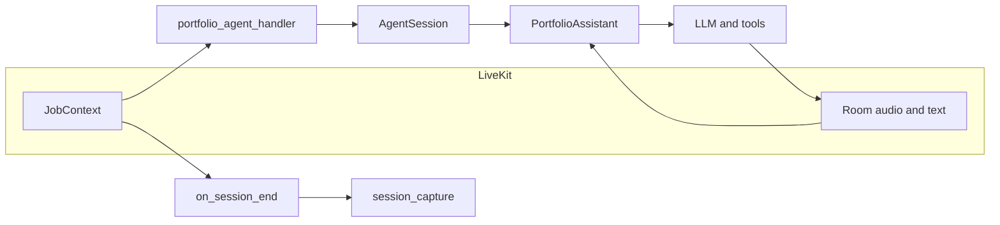
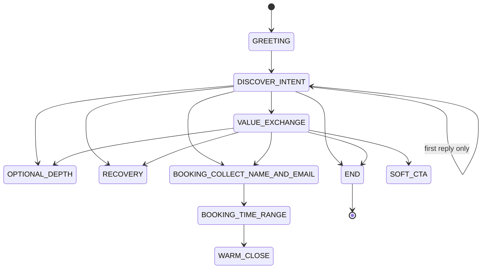
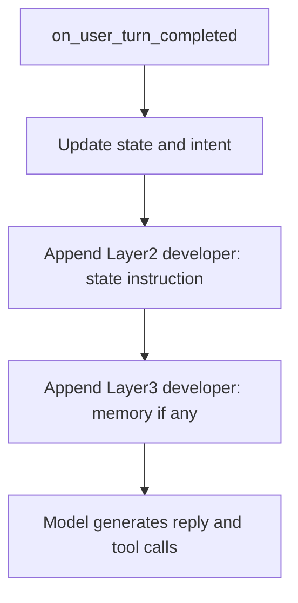

# Architecture — voice portfolio (Melvin)

This document describes how the service is structured, how the agent is orchestrated, how it relates to the [voice UX design doc](../implementations/voice_ux.md), and how the **implemented** conversation state machine works. For setup and environment variables, see the [README](../README.md).

## 1. High-level

**Purpose:** A voice-first portfolio assistant (“Melvin”) that explains Mihir’s work, adapts to visitor intent, optionally nudges toward a call, and can book meetings via Cal.com. Optional post-session capture uploads reports to object storage and records rows in Postgres for on-demand analysis (see [PRD](../implementations/PRD.md)).

**Main entry:** [`src/main.py`](../src/main.py) registers a LiveKit `AgentServer` with:

- Agent name: `melvin`
- RTC session handler: `portfolio_agent_handler` in [`src/hooks/session.py`](../src/hooks/session.py)
- `on_session_end`: [`on_session_end` in `src/hooks/session_capture.py`](../src/hooks/session_capture.py) (session report, R2, DB when configured)

**Runtime flow:**

## 2. Agent orchestration

### Roles

| Piece | Responsibility |
|-------|----------------|
| `AgentSession` ([`session.py`](../src/hooks/session.py)) | STT, LLM, TTS, VAD, turn detection, `BookingUserData` userdata, optional text-input callback, noise cancellation. |
| `PortfolioAssistant` ([`protfolio_agent.py`](../src/agents/protfolio_agent.py)) | Subclass of LiveKit `Agent`: static `instructions`, `on_enter` greeting, `on_user_turn_completed` state routing, function tools. |

### Layered prompts (maps to code)

The design in [voice_ux.md §5](../implementations/voice_ux.md) matches the implementation:

| Layer | Source | Role |
|-------|--------|------|
| **1 — Core persona** | `PORTFOLIO_ASSISTANT_INSTRUCTIONS` in [`src/agents/prompts.py`](../src/agents/prompts.py) | Melvin identity, voice output rules, goals, tools summary, guardrails, Mihir background. Loaded once as agent instructions. |
| **2 — State instruction** | `_build_state_instruction()` in [`protfolio_agent.py`](../src/agents/protfolio_agent.py) | Per-turn developer message: current `ConversationState`, `IntentType`, and goals (e.g. booking vs value exchange). |
| **3 — Memory** | `_build_memory_context()` in the same file | Optional developer message from `memory_hint`, `intent_type`, `booked_before`, `company`, `domain` — soft, non-creepy hedging. |
| **4 — User input** | Chat context | Latest user utterance (and prior history as managed by the framework). |

After each user turn, `on_user_turn_completed` updates `BookingUserData`, then appends Layer 2 and (if present) Layer 3 to the **current turn context** so the next model call is state- and memory-aware.

### Tool calling (mechanics)

Tools are **Python async methods** on `PortfolioAssistant` registered with LiveKit’s `@function_tool` decorator ([`protfolio_agent.py`](../src/agents/protfolio_agent.py)). The runtime:

1. Exposes each tool’s name, description, and parameters to the LLM as a **function / tool schema** alongside Layer 1 instructions.
2. On each model turn, the model may **emit tool calls** (e.g. `set_email`, `get_available_slots`) with arguments.
3. The agent framework **executes** the corresponding method, passing a `RunContext[BookingUserData]` so the tool can read and update `context.userdata` (name, email, `state`, `booking_details`, etc.).
4. The tool **return value** (always a `str` here) is sent back to the model as the tool result. The model then produces spoken text that respects that result (and Layer 2 state rules).

So “tool calling” here is **LLM-driven**: routing for conversation *state* is mostly in `on_user_turn_completed`, but *when* to fetch slots or book is decided by the model within guardrails in the state-specific instructions (e.g. do not call slot APIs in `BOOKING_COLLECT_NAME_AND_EMAIL`).

### Tool reference

| Tool | Role |
|------|------|
| `get_current_datetime` | Returns a spoken-friendly date/time in an optional IANA timezone; bad timezone → UTC. |
| `set_name` / `set_email` | Store only **explicit** user-provided name/email. `set_email` in `BOOKING_COLLECT_NAME_AND_EMAIL` advances state to `BOOKING_TIME_RANGE`. |
| `get_available_slots` | Cal.com **GET** `/slots` for a date range; requires `CALCOM_API_KEY` and `CALCOM_EVENT_TYPE_ID` (see below). |
| `book_meeting` | Cal.com **POST** `/bookings` after a concrete date/time; updates `booking_details` and `WARM_CLOSE` on clear success. |

### Calendar booking (Cal.com)

Implementation: [`src/agents/tools/cal_com_booking.py`](../src/agents/tools/cal_com_booking.py). It uses **Cal.com API v2** with a bearer token and two version headers: `cal-api-version` for **slots** (default `2024-09-04`) and for **bookings** (default `2024-08-13`), both read from [`settings.py`](../src/config/settings.py).

**Typical end-to-end flow**

1. **Identity** — User gives name and email (voice or text). The model calls `set_name` and `set_email` (or the session handler rewrites `name, email` text in [`session.py`](../src/hooks/session.py)).
2. **When to meet** — In `BOOKING_TIME_RANGE`, the model asks for a date range or rough window; it may call `get_current_datetime` to interpret “next Tuesday” etc.
3. **Availability** — `get_available_slots` calls `GET {CALCOM_BASE_URL}/slots` with `eventTypeId`, `start` / `end` window, and `Authorization: Bearer ...`. The module parses JSON and returns **human-readable lines** of slot times (converted to the user’s timezone for TTS). Empty ranges yield a “no slots” string, not an exception.
4. **Selection** — User picks a date and time that matches a returned slot.
5. **Book** — `book_meeting` validates date/time, builds **UTC start** via `_build_start_utc_iso`, then `create_calcom_booking` **POST** `/bookings` with `eventTypeId`, `start` (ISO UTC), and `attendee` (name, email, `timeZone`, language). On HTTP success, the response is turned into a string containing **`Meeting booked successfully`**, which the `PortfolioAssistant` uses to set `booked_before`, `booking_details`, and `WARM_CLOSE`.

**Configuration missing** — `_require_calcom_config()` raises if `CALCOM_API_KEY` or `CALCOM_EVENT_TYPE_ID` is unset. That propagates to the `get_available_slots` / `book_meeting` **wrappers** (see error handling), so the worker does not crash on import if only LiveKit is configured, but the first Cal.com call will fail until env is set.

### Error handling (orchestration)

Errors are handled in **layers** so the agent process stays up and the user gets a **single, calm** recovery turn (also reflected in the static instructions in [`prompts.py`](../src/agents/prompts.py) — tools may fail, apologize once, offer a fallback).

| Layer | What happens |
|--------|----------------|
| **Cal.com HTTP + API shape** | In [`cal_com_booking.py`](../src/agents/tools/cal_com_booking.py), non-2xx responses and unexpected JSON are turned into **return strings** (`Could not fetch slots: …`, `Booking failed: …`, `No available slots…`), with logging. `book_meeting` also returns user-readable strings for **invalid date/time** (`_build_start_utc_iso` / timezone problems) before any HTTP call. **No exception** is raised to the tool wrapper for these cases. |
| **Config guard** | `_require_calcom_config()` raises `ValueError` if Cal.com env is missing. The **`PortfolioAssistant` tool methods** wrap the async Cal.com calls in **`try/except Exception`**: on any exception (including that `ValueError`), they **log** and return a fixed **`ERROR: …`** string that **instructs the model** to apologize once and suggest email or manual times — so the tool never crashes the turn pipeline. |
| **Booking preconditions** | In `book_meeting`, if name and email are still missing, the method returns a normal string (`Cannot book yet: please ask the user for…`) without calling the API. |
| **Booking result vs exception** | After a **successful** HTTP path, `book_meeting` checks whether the result string contains **`Meeting booked successfully`** to set `booking_details` and `WARM_CLOSE`. If the string is an error message from `create_calcom_booking` (e.g. `Booking failed: …`), the wrapper still sets **`WARM_CLOSE`** so the user does not loop forever in booking states. |
| **Details persistence** | Building `BookingDetails` after success is wrapped in `try/except`; failure is logged only — session state still moves to `WARM_CLOSE`. |
| **Greeting / session** | `on_enter` and `_close_after_delay` use light exception logging when closing the session after `END`. |

In short: **expected Cal.com failures** are mostly **string results** from the client module; **unexpected exceptions** are caught at the **agent tool boundary** and converted into model-facing instructions; **state** is advanced to `WARM_CLOSE` after `book_meeting` returns in almost all cases so the conversation can exit gracefully.

**Success detection:** the agent looks for the substring `Meeting booked successfully` in the `book_meeting` result to persist `BookingDetails` and set `booked_before` (see [`protfolio_agent.py`](../src/agents/protfolio_agent.py)).

### Typed text for booking

[`_custom_text_input_handler`](../src/hooks/session.py) rewrites compact input like `Alice, alice@example.com` into an explicit sentence when in `BOOKING_COLLECT_NAME_AND_EMAIL`, so extraction is easier for the model.

### Configuration

All env keys are documented in the [README](../README.md); definitions live in [`src/config/settings.py`](../src/config/settings.py).

## 3. Voice UX (design vs code)

The product principles and stages live in [implementations/voice_ux.md](../implementations/voice_ux.md) (principles P1–P4, stages 1–7, edge cases, metrics). Below is a **concise mapping** to the running agent.

| UX stage (doc) | Code / behavior |
|----------------|-----------------|
| 1 Warm entry | `on_enter`: fixed Melvin greeting, then `DISCOVER_INTENT`. |
| 2 Intent discovery | `DISCOVER_INTENT` + keyword `IntentType` (`EXPLORER`, `HIRING`, `FOUNDER`) from user text (≥3 words). |
| 3 Value exchange | `VALUE_EXCHANGE` — short, direct answers; instruction discourages stacking questions. |
| 4 Optional depth | `OPTIONAL_DEPTH` when depth-style phrases appear. |
| 5 Soft CTA | `SOFT_CTA` once, after enough turns, not for `FOUNDER` intent (see state section). |
| 6 Booking | `BOOKING_*` states + Cal.com tools. |
| 7 Warm close | `WARM_CLOSE` after booking or when ending; `END` on explicit goodbyes. |

**Important:** Section 4 of [voice_ux.md](../implementations/voice_ux.md) shows an **ideal** branching diagram (Explorer / Hiring / FastBook, etc.). The **implemented** routing is a **flatter** finite set of `ConversationState` values updated in Python in `on_user_turn_completed`, plus tool side effects. Use the diagram in **section 4 below** as the source of truth for behavior.

## 4. Conversation state machine (implemented)

### States

Defined on `ConversationState` in [`protfolio_agent.py`](../src/agents/protfolio_agent.py):

`GREETING`, `DISCOVER_INTENT`, `VALUE_EXCHANGE`, `OPTIONAL_DEPTH`, `SOFT_CTA`, `BOOKING_COLLECT_NAME_AND_EMAIL`, `BOOKING_TIME_RANGE`, `BOOKING_PICK_SLOT`, `BOOKING_CONFIRM_BOOKING`, `WARM_CLOSE`, `RECOVERY`, `END`

### How the router updates state

- **`on_enter`:** `GREETING` → scripted first message → `DISCOVER_INTENT`.
- **End of conversation:** if user text matches “goodbye”-style phrases → `END`; session closes shortly after.
- **Booking request** (`_wants_booking`): if name or email missing → `BOOKING_COLLECT_NAME_AND_EMAIL`; if both present → `BOOKING_TIME_RANGE`.
- **If not in a booking substate and not a booking request:**  
  - empty user text → `RECOVERY`  
  - depth request → `OPTIONAL_DEPTH`  
  - very early turn (`turn_count <= 1` and state `GREETING` or `DISCOVER_INTENT`) → stay `DISCOVER_INTENT`  
  - else → `VALUE_EXCHANGE`  
  - then, if `turn_count >= 4`, first soft offer, not still in `DISCOVER_INTENT`, and intent is not `FOUNDER` → override to `SOFT_CTA` and increment `booking_offer_count`.
- **Booking substates** (`BOOKING_COLLECT_NAME_AND_EMAIL`, `BOOKING_TIME_RANGE`, `BOOKING_PICK_SLOT`, `BOOKING_CONFIRM_BOOKING`): while the user does **not** send another booking-style request, state is **left unchanged** (“sticky”) so the flow is not reset mid-booking.
- **Tools:** `set_email` (in collect state) → `BOOKING_TIME_RANGE`. `book_meeting` (success or handled failure) → `WARM_CLOSE` (+ `booking_details` on success path).

`BOOKING_PICK_SLOT` and `BOOKING_CONFIRM_BOOKING` have Layer 2 instructions and are in the sticky set, but **the current `on_user_turn_completed` block does not assign them**; the dominant booking path after `BOOKING_TIME_RANGE` is tool-driven while state may remain in `BOOKING_TIME_RANGE` until completion or `WARM_CLOSE`.

### Diagram (main transitions)

Styling note: mermaid is kept sparse; the bullet list above is authoritative for `SOFT_CTA` and booking stickiness.

Booking substates are **sticky** (no automatic exit on every turn) while the user stays in a booking flow. `BOOKING_PICK_SLOT` and `BOOKING_CONFIRM_BOOKING` are defined for instructions but are not assigned by the Python router today (see above).

### Layer injection after routing

## 5. Other specifics

### Session end capture

[`session_capture.on_session_end`](../src/hooks/session_capture.py) runs when the job ends: builds or receives a session report, can upload to R2 and upsert users/sessions in Postgres when `DATABASE_URL` and R2 settings are set. Details align with [PRD](../implementations/PRD.md).

### Data layer

- [`src/db/`](../src/db/): SQLAlchemy models, Alembic migrations, `sqlc`-style query modules.
- [`src/storage/r2.py`](../src/storage/r2.py): S3‑compatible client for artifacts.

### Testing

- [`tests/test_voice_ux_flows.py`](../tests/test_voice_ux_flows.py) and related tests exercise state and flows.
- [tests/README.md](../tests/README.md) describes how to run them.

## Related documentation

| Document | Contents |
|----------|----------|
| [README.md](../README.md) | Run, install, environment variables |
| [implementations/PRD.md](../implementations/PRD.md) | Session analysis pipeline, storage, goals |
| [implementations/pipeline.md](../implementations/pipeline.md) | Offline analysis stages |
| [implementations/voice_ux.md](../implementations/voice_ux.md) | Product UX, ideal state diagram, edge cases, metrics |
